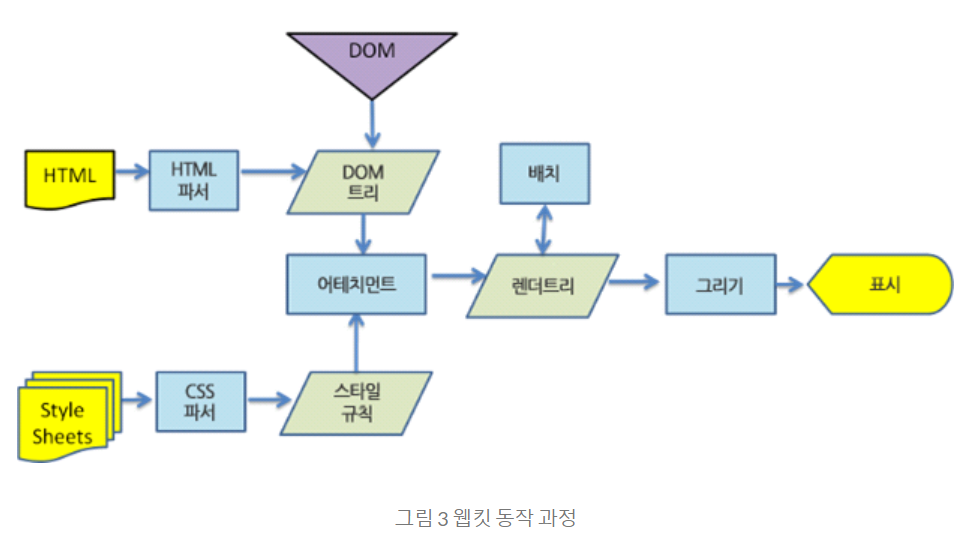
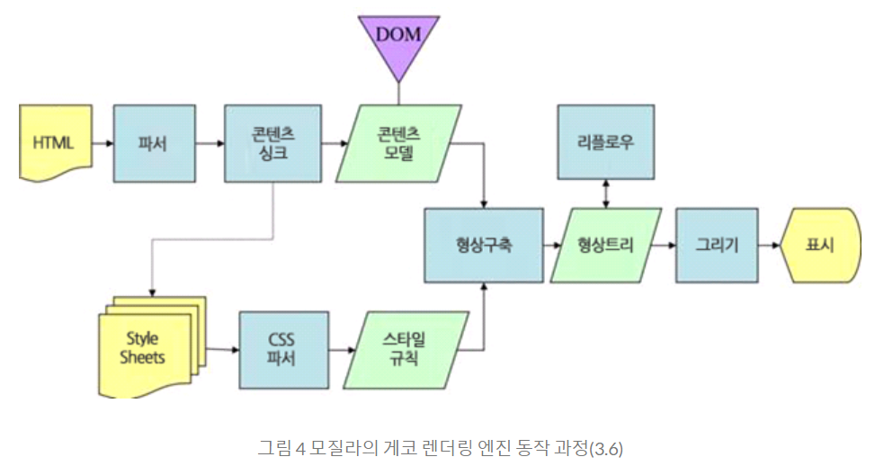
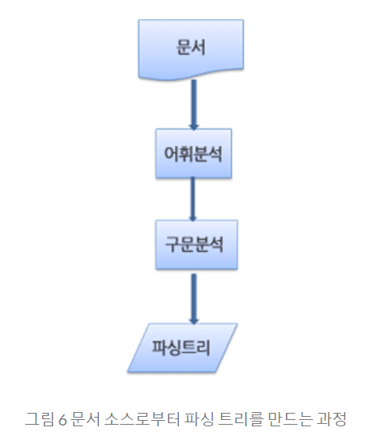
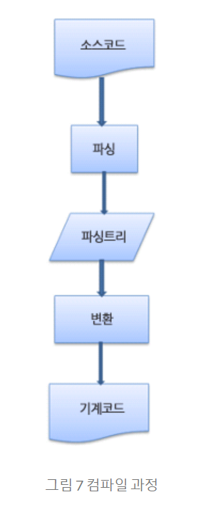
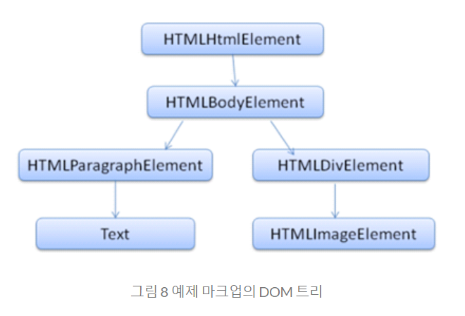
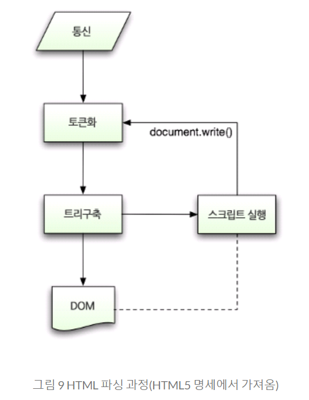
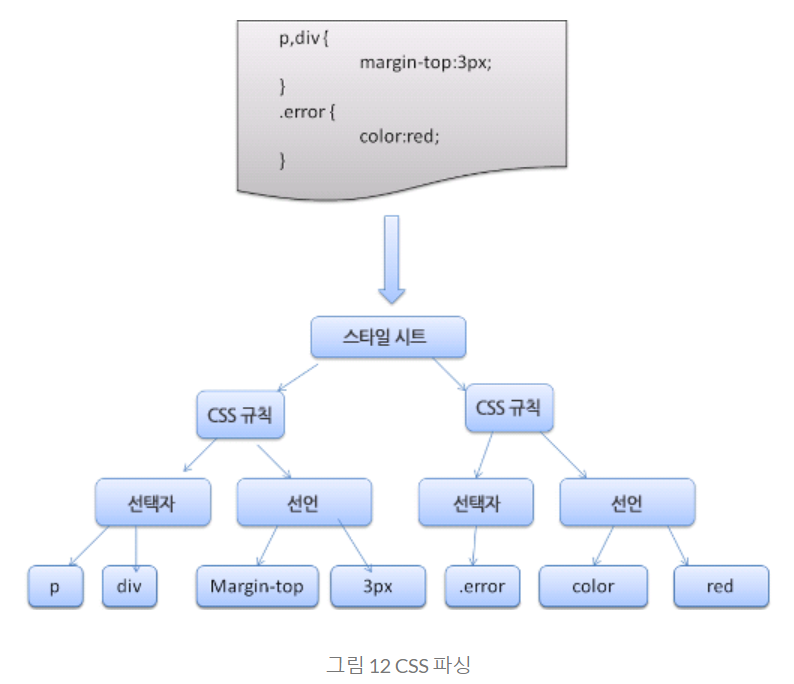

# 브라우저

### 브라우저의 주요 기능은 사용자가 선택한 자원을 서버에 요청하고 브라우저에 표시하는 것이다. 자원은 보통 HTML 문서지만 PDF나 이미지 또는 다른 형태일 수 있다. 자원의 주소는 URI(Uniform Resource Identifier)에 의해 정해진다.

 
 

- 브라우저의 사용자 인터페이스 - URI를 입력할 수 있는 주소 표시 줄 - 이전 버튼과 다음 버튼 - 북마크 - 새로 고침 버튼과 현재 문서의 로드를 중단할 수 있는 정지 버튼 - 홈 버튼
   
   
- 브라우저의 기본 구성 요소
  - 사용자 인터페이스 - 주소 표시줄, 이전/다음 버튼, 북마크 메뉴 등. 요청한 페이지를 보여주는 창을 제외한 나머지 모든 부분이다.
  - 브라우저 엔진 - 사용자 인터페이스와 렌더링 엔진 사이의 동작을 제어.
  - 렌더링 엔진 - 요청한 콘텐츠를 표시. 예를 들어 HTML을 요청하면 HTML과 CSS를 파싱하여 화면에 표시함.
  - 통신 - HTTP 요청과 같은 네트워크 호출에 사용됨. 이것은 플랫폼 독립적인 인터페이스이고 각 플랫폼 하부에서 실행됨.
  - UI 백엔드 - 콤보 박스와 창 같은 기본적인 장치를 그림. 플랫폼에서 명시하지 않은 일반적인 인터페이스로서, OS 사용자 인터페이스 체계를 사용.
  - 자바스크립트 해석기 - 자바스크립트 코드를 해석하고 실행.
  - 자료 저장소 - 이 부분은 자료를 저장하는 계층이다. 쿠키를 저장하는 것과 같이 모든 종류의 자원을 하드 디스크에 저장할 필요가 있다. HTML5 명세에는 브라우저가 지원하는 '웹 데이터 베이스'가 정의되어 있다.

* 크롬은 대부분의 브라우저와 달리 각 탭마다 별도의 렌더링 엔진 인스턴스를 유지하는 것이 주목할만하다. 각 탭은 독립된 프로세스로 처리된다.
   
   

### 렌더링 엔진

 

#### - 렌더링 엔진의 역할은 요청 받은 내용을 브라우저 화면에 표시하는 일이다.

 

#### - 렌더링 엔진은 HTML 및 XML 문서와 이미지를 표시할 수 있다. 물론 플러그인이나 브라우저 확장 기능을 이용해 PDF와 같은 다른 유형도 표시할 수 있다.

 

### FireFox - 게코(Gecko) 엔진

### Safari & Chrome - 웹킷(Webkit) 엔진

 

### 렌더링 엔진 동작 과정

 

#### - 렌더링 엔진은 통신으로부터 요청한 문서의 내용을 얻는 것으로 시작하는데 문서의 내용은 보통 8KB 단위로 전송된다.

 

1. DOM 트리 구축 위한 HTML 파싱
2. 렌더 트리 구축
3. 렌더 트리 배치
4. 렌더 트리 그리기

#### 렌더링 엔진은 HTML 문서를 파싱하고 "콘텐츠 트리"내부에서 태그를 DOM 노드로 변환한다.

#### 그 다음 외부 CSS 파일과 함께 포함된 스타일 요소도 파싱한다.

#### 스타일 정보와 HTML 표시 규칙은 "렌더 트리"라고 부르는 또 다른 트리를 생성한다.

 

#### 렌더 트리는 색상 또는 면적과 같은 시각적 속성이 있는 사각형을 포함하고 있는데, 정해진 순서대로 화면에 표시된다.

 

#### 렌더 트리 생성이 끝나면 배치가 시작되는데

#### 이것은 각 노드가 화면의 정확한 위치에 표시되는 것을 의미한다.

#### 다음은 UI 백엔드에서 렌더 트리의 각 노드를 가로지르며 형상을 만들어 내는 그리기 과정이다.

 

#### 일련의 과정들이 점진적으로 진행된다는 것을 아는 것이 중요하다. 렌더링 엔진은 좀 더 나은 사용자 경험을 위해 가능하면 빠르게 내용을 표시하는데 모든 HTML을 파싱할 때까지 기다리지 않고, 배치와 그리기 과정을 시작한다.

#### 네트워크로부터 나머지 내용이 전송되기를 기다리는 동시에 받은 내용의 일부를 먼저 화면에 표시하는 것이다.

 
 

### 게코와 웹킷은 용어만 살짝 다를뿐 동작과정이 기본적으로 동일하다.

 

#### 게코는 시각적으로 처리되는 렌더 트리를 "형상 트리(frame tree)"라고 부르고 각 요소를 형상(frame)이라고 하는데 웹킷은 "렌더 객체(render object)"로 구성되어 있는 "렌더 트리(render tree)"라는 용어를 사용한다. 웹킷은 요소를 배치하는데 "배치(layout)" 라는 용어를 사용하지만 게코는 "리플로(reflow)" 라고 부른다. "어태치먼트(attachment)"는 웹킷이 렌더 트리를 생성하기 위해 DOM 노드와 시각 정보를 연결하는 과정이다. 게코는 HTML과 DOM 트리 사이에 "콘텐츠 싱크(content sink)"라고 부르는 과정을 두는데 이는 DOM 요소를 생성하는 공정으로 웹킷과 비교하여 의미있는 차이점이라고 보지는 않는다.

 
 

### 파싱

- 문서 파싱 : 브라우저가 코드를 이해하고 사용할 수 있는 구조로 변환하는 것을 의미한다. 파싱 결과는 보통 문서 구조를 나타내는 노드 트리인데 파싱 트리(parse tree) 또는 문법 트리(syntax tree)라고 부른다.
- 문법 : 파싱은 문서에 작성된 언어 또는 형식의 규칙에 따르는데 파싱할 수 있는 모든 형식은 정해진 용어와 구문 규칙에 따라야 한다. 이것을 문맥 자유 문법이라고 한다.

 

### 파서-어휘 분석기 조합

#### 어휘분석 & 구문분석

- 어휘분석 : 어휘 분석은 자료를 토큰으로 분해하는 과정이다. 토큰은 유효하게 구성된 단위의 집합체로 용어집이라고도 할 수 있는데 인간의 언어로 말하자면 사전에 등장하는 모든 단어에 해당된다.
- 구문분석 : 구문 분석은 언어의 구문 규칙을 적용하는 과정이다.
- 파서는 보통 두 가지 일을 하는데 자료를 유효한 토큰으로 분해하는 어휘 분석기(토큰 변환기)가 있고
- 언어 구문 규칙에 따라 문서 구조를 분석함으로써 파싱 트리를 생성하는 파서가 있다. 어휘 분석기는 공백과 줄 바꿈 같은 의미 없는 문자를 제거한다.

- 파싱 과정은 반복된다. 파서는 보통 어휘 분석기로부터 새 토큰을 받아서 구문 규칙과 일치하는지 확인한다. 규칙에 맞으면 토큰에 해당하는 노드가 파싱 트리에 추가되고 파서는 또 다른 토큰을 요청한다.
- 규칙에 맞지 않으면 파서는 토큰을 내부적으로 저장하고 토큰과 일치하는 규칙이 발견될 때까지 요청한다. 맞는 규칙이 없는 경우 예외로 처리하는데 이것은 문서가 유효하지 않고 구문 오류를 포함하고 있다는 의미다.
   
   

### 변환

 

#### 파서 트리는 최종 결과물이 아니다. 파싱은 보통 문서를 다른 양식으로 변환하는데 컴파일이 하나의 예가 된다. 소스 코드를 기계 코드로 만드는 컴파일러는 파싱 트리 생성 후 이를 기계 코드 문서로 변환한다.

### 파서의 종류

#### 파서는 기본적으로 하향식 파서와 상향식 파서가 있다. 하향식 파서는 구문의 상위 구조로부터 일치하는 부분을 찾기 시작하는데 반해 상향식 파서는 낮은 수준에서 점차 높은 수준으로 찾는다.

 

- 하향식 파서 : 높은 수준의 규칙을 먼저 찾는다. 표현식을 찾는 과정은 일치하는 다른 규칙을 점진적으로 더 찾아내는 방식인데 어쨌거나 가장 높은 수준의 규칙을 먼저 찾는 것으로부터 시작한다.

- 상향식 파서 : 입력 값이 규칙에 맞을 때까지 찾아서 맞는 입력 값을 규칙으로 바꾸는데 이 과정은 입력 값의 끝까지 진행된다. 부분적으로 일치하는 표현식은 파서 스택에 쌓인다.

- 상향식 파서는 입력 값의 오른쪽으로 이동하면서(입력 값의 처음을 가리키는 포인터가 오른쪽으로 이동하는 것을 상상) 구문 규칙으로 갈수록 남는 것이 점차 감소하기 때문에 이동-감소 파서라고 부른다.

### 파서 생성기

#### 파서를 생성해 줄 수 있는 도구를 파서 생성기라고 한다. 언어에 어휘나 구문 규칙 같은 문법을 부여하면 동작하는 파서를 만들어 준다. 파서를 생성하는 것은 파싱에 대한 깊은 이해를 필요로 하고 수동으로 파서를 최적화하여 생성하는 것은 쉬운 일이 아니기 때문에 파서 생성기는 매우 유용하다.

 

     Webkit의 파서 생성기
    1. 어휘 생성을 위한 플렉스(Flex) :
        플렉스는 토큰의 정규 표현식 정의를 포함하는 파일을 입력 받는다.
    2. 파서 생성을 위한 바이슨(Bison) :
        바이슨은 BNF 형식의 언어 구문 규칙을 입력 받는다.

### HTML 파서?

 

- HTML 파서는 HTML 마크업을 파싱 트리로 변환한다.
- HTML의 어휘와 문법은 W3C에 의해 명세로 정의되어 있다. 현재 버전은 HTML4와 초안 상태로 진행 중인 HTML5 이다.
- HTML는 문맥 자유 문법이 아니다.
- 파싱 일반 소개를 통해 알게 된 것처럼 문법은 BNF와 같은 형식을 이용하여 공식적으로 정의할 수 있다.
- 안타깝게도 모든 전통적인 파서는 HTML에 적용할 수 없다. 그럼에도 불구하여 지금까지 파싱을 설명한 것은 그냥 재미 때문은 아니다. 파싱은 CSS와 자바스크립트를 파싱하는 데 사용된다. HTML은 파서가 요구하는 문맥 자유 문법에 의해 쉽게 정의할 수 없다.
- HTML 정의를 위한 공식적인 형식으로 DTD(문서 형식 정의)가 있지만 이것은 문맥 자유 문법이 아니다.
- HTML은 암묵적으로 태그에 대한 생략이 가능하다. 가끔 시작 또는 종료 태그 등을 생략한다. 전반적으로 뻣뻣하고 부담스러운 XML에 반하여 HTML은 "유연한" 문법이다.
- HTML은 파싱하기 어렵고 전통적인 구문 분석이 불가능하기 때문에 문맥 자유 문법이 아니라는 것이다. XML 파서로도 파싱하기 쉽지 않다.

 
 

### HTML DTD

 

#### HTML의 정의는 DTD 형식 안에 있는데 SGML 계열 언어의 정의를 이용한 것이다. 이 형식은 허용되는 모든 요소와 그들의 속성 그리고 중첩 구조에 대한 정의를 포함한다. 앞서 말 한대로 HTML DTD는 문맥 자유 문법이 아니다.

 

#### DTD는 여러 변종이 있다. 엄격한 형식은 명세만을 따르지만 다른 형식은 낡은 브라우저에서 사용된 마크업을 지원한다. 낡은 마크업을 지원하는 이유는 오래된 콘텐츠에 대한 하위 호환성 때문이다.

 

### DOM

#### "파싱 트리"는 DOM 요소와 속성 노드의 트리로서 출력 트리가 된다. DOM은 문서 객체 모델(Document Object Model)의 준말이다. 이것은 HTML 문서의 객체 표현이고 외부를 향하는 자바스크립트와 같은 HTML 요소의 연결 지점이다. 트리의 최상위 객체는 문서이다.

       <html>
        <body>
        
Hello World

        

        </body>
        </html>

- HTML과 마찬가지로 DOM은 W3C에 의해 명세가 정해져있다. 이것은 문서를 다루기 위한 일반적인 명세인데 부분적으로 HTML 요소를 설명하기도 한다.

- 트리가 DOM 노드를 포함한다고 말하는 것은 DOM 접점의 하나를 실행하는 요소를 구성한다는 의미다. 브라우저는 내부의 다른 속성들을 이용하여 이를 구체적으로 실행한다.

 
 

### 파싱 알고리즘

#### 앞서 말한대로 HTML은 일반적인 하향식 또는 상향식 파서로 파싱이 안되는데 그 이유는 다음과 같다.

    1. 언어의 너그러운 속성.
    2. 잘 알려져 있는 HTML 오류에 대한 브라우저의 관용.
    3. 변경에 의한 재파싱.
    일반적으로 소스는 파싱하는 동안 변하지 않지만 HTML에서 document.write을 포함하고 있는 스크립트 태그는 토큰을 추가할 수 있기 때문에 실제로는 입력 과정에서 파싱이 수정된다.

 
 

- 일반적인 파싱 기술을 사용할 수 없기 때문에 브라우저는 HTML 파싱을 위해 별도의 파서를 생성한다.

- 파싱 알고리즘은 '토큰화'와 '트리 구축' 이렇게 두 단계로 되어 있다.

  - 토큰화는 어휘 분석으로서 입력 값을 토큰으로 파싱한다. HTML에서 토큰은 시작 태그, 종료 태그, 속성 이름과 속성 값이다.
  - 토큰화는 토큰을 인지해서 트리 생성자로 넘기고 다름 토큰을 확인하기 위해 다음 문자를 확인한다. 그리고 입력의 마지막까지 이 과정을 반복한다.

 
 

### 토큰화 알고리즘

#### 알고리즘의 결과물은 HTML 토큰이다. 알고리즘은 상태 기계(State Machine)라고 볼 수 있다. 각 상태는 하나 이상의 연속된 문자를 입력받아 이 문자에 따라 다음 상태를 갱신한다. 그러나 결과는 현재의 토큰화 상태와 트리 구축 상태의 영향을 받는데. 이것은 같은 문자를 읽어 들여도 현재 상태에 따라 다음 상태의 결과가 다르게 나온다는 것을 의미한다.

 

### 트리 구축 알고리즘

#### 파서가 생성되면 문서 객체가 생성된다. 트리 구축이 진행되는 동안 문서 최상단에서는 DOM 트리가 수정되고 요소가 추가된다. 토큰화에 의해 발행된 각 노드는 트리 생성자에 의해 처리된다. 각 토큰을 위한 DOM 요소의 명세는 정의되어 있다. DOM 트리에 요소를 추가하는 것이 아니라면 열린 요소는 스택(임시 버퍼 저장소)에 추가된다. 이 스택은 부정확한 중첩과 종료되지 않은 태그를 교정한다. 알고리즘은 상태 기계라고 설명할 수 있고 상태는 "삽입 모드" 라고 부른다.

 

### 파싱이 끝난 이후의 동작

#### 이번 단계에서 브라우저는 문서와 상호작용할 수 있게 되고 문서 파싱 이후에 실행되어야 하는 "지연" 모드 스크립트를 파싱하기 시작한다. 문서 상태는 "완료"가 되고 "로드" 이벤트가 발생한다.

 

### 브라우저의 오류 처리

#### HTML 페이지에서 "유효하지 않은 구문" 이라는 오류를 본 적이 없을 것이다. 이는 브라우저가 모든 오류 구문을 교정하기 때문이다.

 

#### 파서는 토큰화된 입력 값을 파싱하여 문서를 만들고 문서 트리를 생성한다. 규칙에 맞게 잘 작성된 문서라면 파싱이 수월하겠지만 불행하게도 형식에 맞지 않게 작성된 많은 HTML 문서를 다뤄야 하기 때문에 파서는 오류에 대한 아량이 있어야 한다.

#### 파서는 적어도 다음과 같은 오류를 처리해야 한다.

    1. 어떤 태그의 안쪽에 추가하려는 태그가 금지된 것일 때 일단 허용된 태그를 먼저 닫고 금지된 태그는 외부에 추가한다.
    2. 파서가 직접 요소를 추가해서는 안된다. 문서 제작자에 의해 뒤늦게 요소가 추가될 수 있고 생략 가능한 경우도 있다. HTML, HEAD, BODY, TBODY, TR, TD, LI 태그가 이런 경우에 해당한다.
    3. 인라인 요소 안쪽에 블록 요소가 있는 경우 부모 블록 요소를 만날 때까지 모든 인라인 태그를 닫는다.
    4. 이런 방법이 도움이 되지 않으면 태그를 추가하거나 무시할 수 있는 상태가 될 때까지 요소를 닫는다.

   

    -   대신  
      어떤 사이트는   대신  을 사용한다. 인터넷 익스플로러, 파이어폭스와 호환성을 갖기 위해 웹킷은 이것을   으로 간주한다.

    - 어긋난 표
      어긋난 표는 표 안에 또 다른 표가 th 또는 td 셀 내부에 있지 않은 것을 의미한다. 이런 경우 웹킷은 표의 중첩을 분해하여 형제 요소가 되도록 처리한다.

    - 중첩된 폼 요소
      폼 안에 또 다른 폼을 넣은 경우 안쪽의 폼은 무시된다.

    - 태그 중첩이 너무 깊을 때
      최대 20개의 중첩만 허용하고 나머지는 무시한다.

    - 잘못 닫힌 html 또는 body 태그
      깨진 html을 지원한다. 일부 바보 같은 페이지는 문서가 끝나기 전에 body를 닫아버리기 때문에 브라우저는 body 태그를 닫지 않는다. 대신 종료를 위해 end()를 호출한다.

 

### CSS 파싱

 

#### CSS는 문맥 자유 문법이고 소개 글에서 설명했던 파서 유형을 이용하여 파싱이 가능하다.

 

### Webkit CSS 파서

 

#### 웹킷은 CSS 문법 파일로부터 자동으로 파서를 생성하기 위해 플렉스와 바이슨 파서 생성기를 사용한다. 파서 소개에서 언급했던 것처럼 바이슨은 상향식 이동 감소 파서를 생성한다. 파이어폭스는 직접 작성한 하향식 파서를 사용한다. 두 경우 모두 각 CSS 파일은 스타일 시트 객체로 파싱되고 각 객체는 CSS 규칙을 포함한다. CSS 규칙 객체는 선택자와 선언 객체 그리고 CSS 문법과 일치하는 다른 객체를 포함한다.

 

### 스크립트

 

#### 웹은 파싱과 실행이 동시에 수행되는 동기화(synchronous) 모델이다. 제작자는 파서가 < script > 태그를 만나면 즉시 파싱하고 실행하기를 기대한다. 스크립트가 실행되는 동안 문서의 파싱은 중단된다. 스크립트가 외부에 있는 경우 우선 네트워크로부터 자원을 가져와야 하는데 이 또한 실시간으로 처리되고 자원을 받을 때까지 파싱은 중단된다. 이 모델은 수 년간 지속됐고 HTML4와 HTML5의 명세에도 정의되어 있다. 제작자는 스크립트를 "지연(defer)"으로 표시할 수 있는데 지연으로 표시하게 되면 문서 파싱은 중단되지 않고 문서 파싱이 완료된 이후에 스크립트가 실행된다. HTML5는 스크립트를 비동기(asynchronous)로 처리하는 속성을 추가했기 때문에 별도의 맥락에 의해 파싱되고 실행된다.

 

### 예측 파싱

 

#### 웹킷과 파이어폭스는 예측 파싱과 같은 최적화를 지원한다. 스크립트를 실행하는 동안 다른 스레드는 네트워크로부터 다른 자원을 찾아 내려받고 문서의 나머지 부분을 파싱한다. 이런 방법은 자원을 병렬로 연결하여 받을 수 있고 전체적인 속도를 개선한다. 참고로 예측 파서는 DOM 트리를 수정하지 않고 메인 파서의 일로 넘긴다. 예측 파서는 외부 스크립트, 외부 스타일 시트와 외부 이미지와 같이 참조된 외부 자원을 파싱할 뿐이다.

 

### 스타일시트

 

#### 한편 스타일 시트는 다른 모델을 사용한다. 이론적으로 스타일 시트는 DOM 트리를 변경하지 않기 때문에 문서 파싱을 기다리거나 중단할 이유가 없다. 그러나 스크립트가 문서를 파싱하는 동안 스타일 정보를 요청하는 경우라면 문제가 된다. 스타일이 파싱되지 않은 상태라면 스크립트는 잘못된 결과를 내놓기 때문에 많은 문제를 야기한다. 이런 문제는 흔치 않은 것처럼 보이지만 매우 빈번하게 발생한다. 파이어폭스는 아직 로드 중이거나 파싱 중인 스타일 시트가 있는 경우 모든 스크립트의 실행을 중단한다. 한편 웹킷은 로드되지 않은 스타일 시트 가운데 문제가 될만한 속성이 있을 때에만 스크립트를 중단한다.

 

### 렌더 트리 구축

#### DOM 트리가 구축되는 동안 브라우저는 렌더 트리를 구축한다. 표시해야 할 순서와 문서의 시각적인 구성 요소로써 올바른 순서로 내용을 그려낼 수 있도록 하기 위한 목적이 있다.

#### 파이어폭스는 이 구성 요소를 "형상(frames)" 이라고 부르고 웹킷은 "렌더러(renderer)" 또는 "렌더 객체(render object)"라는 용어를 사용한다.

#### 렌더러는 자신과 자식 요소를 어떻게 배치하고 그려내야 하는지 알고 있다.

 

### DOM 트리와 렌더 트리의 관계

 

#### 렌더러는 DOM 요소에 부합하지만 1:1로 대응하는 관계는 아니다. 예를 들어 "head" 요소와 같은 비시각적 DOM 요소는 렌더 트리에 추가되지 않는다. 또한 display 속성에 "none" 값이 할당된 요소는 트리에 나타나지 않는다(visibility 속성에 "hidden" 값이 할당된 요소는 트리에 나타난다).

 

#### 여러 개의 시각 객체와 대응하는 DOM 요소도 있는데 이것들은 보통 하나의 사각형으로는 묘사할 수 없는 복잡한 구조다. 예를 들면 "select" 요소는 '표시 영역, 드롭다운 목록, 버튼' 표시를 위한 3개의 렌더러가 있다. 또한 한 줄에 충분히 표시할 수 없는 문자가 여러 줄로 바뀔 때 새 줄은 별도의 렌더러로 추가된다. 여러 렌더러와 대응하는 또 다른 예는 깨진 HTML이다. CSS 명세에 의하면 인라인 박스는 블록 박스만 포함하거나 인라인 박스만을 포함해야 하는데 인라인과 블록 박스가 섞인 경우 인라인 박스를 감싸기 위한 익명의 블록 렌더러가 생성된다.

 

#### 어떤 렌더 객체는 DOM 노드에 대응하지만 트리의 동일한 위치에 있지 않다. float 처리된 요소 또는 position 속성 값이 absolute로 처리된 요소는 흐름에서 벗어나 트리의 다른 곳에 배치된 상태로 형상이 그려진다. 대신 자리 표시자가 원래 있어야 할 곳에 배치된다.

 

### 트리를 구축하는 과정

 

#### 파이어폭스에서 프레젠테이션은 DOM 업데이트를 위한 리스너로 등록된다. 프레젠테이션은 형상 만들기를 FrameConstructor에 위임하고 FrameConstructor는 스타일(스타일 계산 참고)을 결정하고 형상을 만든다.

 

#### 웹킷에서는 스타일을 결정하고 렌더러를 만드는 과정을 "어태치먼트(attachment)" 라고 부른다. 모든 DOM 노드에는 "attach" 메서드가 있다. 어태치먼트는 동기적인데 DOM 트리에 노드를 추가하면 새 노드의 "attach" 메서드를 호출한다.

 

#### html 태그와 body 태그를 처리함으로써 렌더 트리 루트를 구성한다. 루트 렌더 객체는 CSS 명세에서 포함 블록(다른 모든 블록을 포함하는 최상위 블록)이라고 부르는 그것과 일치한다. 파이어폭스는 이것을 ViewPortFrame이라 부르고 웹킷은 RenderView라고 부른다. 이것이 문서가 가리키는 렌더 객체다. 트리의 나머지 부분은 DOM 노드를 추가함으로써 구축된다.

 

### 스타일 계산

#### 렌더 트리를 구축하려면 각 렌더 객체의 시각적 속성에 대한 계산이 필요한데 이것은 각 요소의 스타일 속성을 계산함으로써 처리된다.

 

#### 스타일은 인라인 스타일 요소와 HTML의 시각적 속성(예를 들면 bgcolor 같은 HTML 속성)과 같은 다양한 형태의 스타일 시트를 포함하는데 HTML의 시각적 속성들은 대응하는 CSS 스타일 속성으로 변환된다.

 

#### 최초의 스타일 시트는 브라우저가 제공하는 기본 스타일 시트인데 페이지 제작자 또는 사용자도 이를 제공할 수 있다. 브라우저는 사용자가 선호하는 스타일을 정의할 수 있도록 지원하는데 파이어폭스의 경우 "파이어폭스 프로필" 폴더에 있는 스타일 시트를 변경함으로써 사용자 선호 스타일을 정의할 수 있다.
